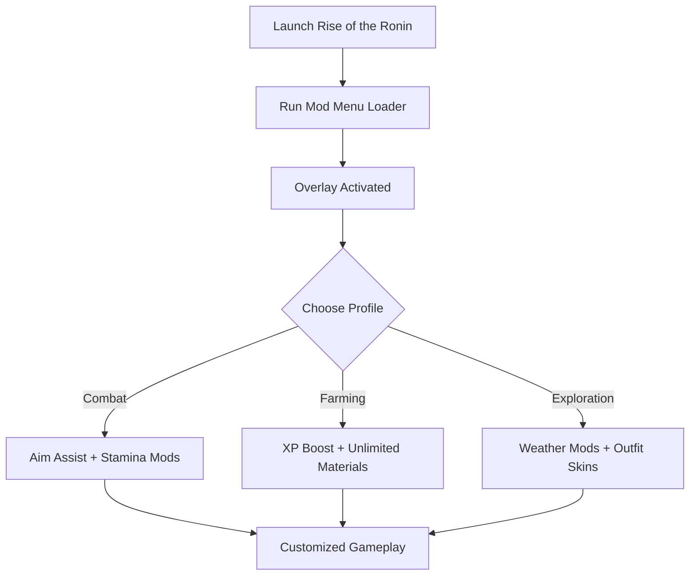

# Rise of the Ronin Mod Menu 🗡

**Rise of the Ronin** delivers fast-paced action, open-world exploration, and deep combat systems. But if you want to tailor the game to your style, the **Rise of the Ronin Mod Menu** gives you full control. With real-time overlays, you can toggle **combat assists, resource boosts, and visual mods** without ever leaving the game.

---

## 🌐 Overview

The Mod Menu acts as an **in-game hub** for enhancements. Whether you want a smoother combat experience, faster farming, or fresh visuals, everything is managed through a sleek overlay. It’s lightweight, customizable, and optimized for Windows PCs.

---

## 🔑 Features

* 🖥 **Overlay UI** – Manage mods directly from an in-game menu.
* ⚔️ **Combat Tweaks** – Aim assists, stamina multipliers, and parry windows.
* 💰 **Resource Boosts** – Infinite money, crafting materials, and XP scaling.
* 🌸 **Visual Mods** – Change weather, time cycles, and outfit skins.
* 🗂 **Profile Manager** – Save presets for farming, exploration, or combat.
* ⌨️ **Hotkey Controls** – Toggle features instantly with one keypress.
* 🔒 **Lightweight Loader** – Minimal performance impact on Windows 10/11.

---

[](#)
[](#)
[](#)
[](#)

---

## 🖥 Compatibility

| Platform       | Status        | Notes                          |
| -------------- | ------------- | ------------------------------ |
| Windows 10     | ✅ Supported   | Stable builds                  |
| Windows 11     | ✅ Optimized   | Smoothest overlay rendering    |
| Linux (Proton) | ⚠️ Limited    | Menu loads, some mods unstable |
| macOS          | ❌ Unsupported | VM-only workaround             |

\[!NOTE]
The mod menu is built for **Windows PC** with DirectX rendering.

---

## ⚙️ Setup Guide

1. Download the Rise of the Ronin Mod Menu package.

2. Extract into the game’s installation directory.

3. Launch Rise of the Ronin.

4. Run the mod loader as administrator:

   ```bash
   ronin_modmenu.exe -game ronin.exe -overlay on
   ```

5. Open the in-game menu with `F4`.

6. Adjust mods in real time or edit `modmenu.ini`:

   ```ini
   [Combat]
   Stamina=Unlimited
   ParryWindow=Extended
   AimAssist=True

   [Resources]
   Money=Unlimited
   XP=Multiplier:3
   Crafting=Unlimited

   [Visuals]
   Weather=Clear
   TimeCycle=Paused
   Outfit=SamuraiArmor
   ```

\[!IMPORTANT]
Always back up saves before activating experimental mods.

---

## 📊 Menu Workflow



---

## 🎚 Example Configurations

**Combat Build:**

```ini
Stamina=Unlimited
ParryWindow=Extended
AimAssist=True
```

**Farming Build:**

```ini
XP=Multiplier:5
Money=Unlimited
Crafting=Unlimited
```

**Exploration Build:**

```ini
Weather=Dynamic
TimeCycle=Slowed
Outfit=RoninRags
```

\[!WARNING]
Stacking too many resource boosts at once may trivialize progression.

---

## ❓ FAQ

**Q: Does the mod menu disable achievements?**
A: Yes, using cheats may disable progression achievements.

**Q: Can I switch mods mid-game?**
A: Yes, toggle them instantly with the overlay or hotkeys.

**Q: Is multiplayer supported?**
A: No, the mod menu is for single-player only.

**Q: Will updates track new patches?**
A: Yes, mod menu updates follow major patches.

**Q: Does it affect FPS?**
A: No, it’s optimized to run with minimal system load.

---

## 🚀 Final Thoughts

The **Rise of the Ronin Mod Menu** delivers **combat tweaks, farming boosts, and visual customization** in one user-friendly package. Whether you’re mastering sword duels, farming resources, or exploring the open world, it lets you tailor the game to your perfect experience.

[](#)
[](#)
[](#)

---
